# 🏗️ ibuddy Architecture Diagrams

This document contains visual dependency maps for ibuddy2.0.

## 📋 Table of Contents
1. [Current Development Architecture](#current-development-architecture)
2. [AWS Production Architecture](#aws-production-architecture)
3. [Component Dependencies](#component-dependencies)
4. [Data Flow Diagram](#data-flow-diagram)
5. [DrawIO XML Export](#drawio-xml-export)

---

## 🔄 Current Development Architecture


---

## ☁️ AWS Production Architecture

```mermaid
graph TB
    subgraph "🌐 Internet"
        USER[👤 Users]
        GITHUB[GitHub Pages<br/>kji304ts.github.io]
    end
    
    subgraph "☁️ AWS Cloud"
        subgraph "🔀 Load Balancing"
            ALB[Application Load Balancer<br/>your-app.amazonaws.com]
        end
        
        subgraph "🚢 Container Orchestration"
            ECS[ECS/EKS Cluster]
            
            subgraph "📦 Container Instances"
                CONTAINER1[ibuddy Container 1]
                CONTAINER2[ibuddy Container 2]
                CONTAINER3[ibuddy Container N...]
            end
        end
        
        subgraph "💾 Storage Services"
            S3[S3 Bucket<br/>Report Storage]
            EFS[EFS<br/>Shared File System]
        end
        
        subgraph "📊 Monitoring & Logs"
            CLOUDWATCH[CloudWatch<br/>Logs & Metrics]
            XRAY[X-Ray<br/>Tracing]
        end
    end
    
    subgraph "🔧 Container Content"
        subgraph "🖥️ FastAPI Application"
            APP[app.py<br/>API Server]
            LLM5_PROD[LLM5.py<br/>Processing Engine]
            UTILS_PROD[Utils Layer<br/>All Helper Modules]
        end
    end
    
    subgraph "🌍 External Services"
        INTERCOM_API[Intercom API]
        SLACK_API[Slack API]
    end
    
    %% User Traffic Flow
    USER --> GITHUB
    USER --> ALB
    GITHUB --> ALB
    
    %% Load Balancing
    ALB --> ECS
    ECS --> CONTAINER1
    ECS --> CONTAINER2
    ECS --> CONTAINER3
    
    %% Container Internal Structure
    CONTAINER1 --> APP
    CONTAINER2 --> APP
    CONTAINER3 --> APP
    APP --> LLM5_PROD
    APP --> UTILS_PROD
    
    %% Storage
    APP --> S3
    APP --> EFS
    LLM5_PROD --> S3
    LLM5_PROD --> EFS
    
    %% External APIs
    UTILS_PROD --> INTERCOM_API
    UTILS_PROD --> SLACK_API
    
    %% Monitoring
    CONTAINER1 --> CLOUDWATCH
    CONTAINER2 --> CLOUDWATCH
    CONTAINER3 --> CLOUDWATCH
    APP --> XRAY
    
    %% Styling
    classDef aws fill:#ff9900,color:#fff
    classDef container fill:#232f3e,color:#fff
    classDef app fill:#4caf50
    classDef external fill:#ffebee
    classDef user fill:#e3f2fd
    classDef storage fill:#f1f8e9
    classDef monitoring fill:#fff3e0
    
    class ALB,ECS,S3,EFS,CLOUDWATCH,XRAY aws
    class CONTAINER1,CONTAINER2,CONTAINER3 container
    class APP,LLM5_PROD,UTILS_PROD app
    class INTERCOM_API,SLACK_API external
    class USER,GITHUB user
    class S3,EFS storage
    class CLOUDWATCH,XRAY monitoring
```



---

## 🔗 Component Dependencies

```mermaid
graph LR
    subgraph "📱 Frontend"
        HTML[index.html]
        JS[script.js]
        CSS[styles.css]
    end
    
    subgraph "🔌 API Layer"
        FASTAPI_APP[app.py]
        ROUTES[API Routes]
        MIDDLEWARE[CORS Middleware]
    end
    
    subgraph "🧠 Business Logic"
        LLM5_MAIN[LLM5.py]
        MAIN_FUNC[main_function]
        ANALYSIS[analyze_xlsx_and_generate_insights]
        REPORTS[generate_end_of_shift_report]
    end
    
    subgraph "🛠️ Utilities"
        INTERCOM[intercom_utils.py]
        SLACK[slack_notifier.py]
        TEAMS[intercom_team_fetcher.py]
        TIME[time_utils.py]
    end
    
    subgraph "📊 Data Processing"
        SEARCH[search_conversations]
        FILTER[filter_conversations_by_area]
        EXCEL[store_conversations_to_xlsx]
        NLP[TextBlob Analysis]
    end
    
    subgraph "🗂️ File Management"
        OUTPUT_DIR[output_files/]
        INSIGHTS_DIR[Outputs/]
        TEAM_DIR[team_reports/]
        ZIP[ZIP Downloads]
    end
    
    %% Dependencies
    JS --> FASTAPI_APP
    FASTAPI_APP --> LLM5_MAIN
    FASTAPI_APP --> TEAMS
    
    LLM5_MAIN --> MAIN_FUNC
    MAIN_FUNC --> ANALYSIS
    MAIN_FUNC --> REPORTS
    
    LLM5_MAIN --> INTERCOM
    LLM5_MAIN --> SLACK
    LLM5_MAIN --> TIME
    
    INTERCOM --> SEARCH
    INTERCOM --> FILTER
    LLM5_MAIN --> EXCEL
    ANALYSIS --> NLP
    
    LLM5_MAIN --> OUTPUT_DIR
    LLM5_MAIN --> INSIGHTS_DIR
    LLM5_MAIN --> TEAM_DIR
    FASTAPI_APP --> ZIP
    
    %% Styling
    classDef frontend fill:#e1f5fe
    classDef api fill:#f3e5f5
    classDef logic fill:#e8f5e8
    classDef utils fill:#fff3e0
    classDef data fill:#f8f9fa
    classDef files fill:#f1f8e9
    
    class HTML,JS,CSS frontend
    class FASTAPI_APP,ROUTES,MIDDLEWARE api
    class LLM5_MAIN,MAIN_FUNC,ANALYSIS,REPORTS logic
    class INTERCOM,SLACK,TEAMS,TIME utils
    class SEARCH,FILTER,EXCEL,NLP data
    class OUTPUT_DIR,INSIGHTS_DIR,TEAM_DIR,ZIP files
```



---

## 📈 Data Flow Diagram

```mermaid
sequenceDiagram
    participant U as 👤 User
    participant F as 🌐 Frontend
    participant A as 🔌 FastAPI
    participant L as 🧠 LLM5.py
    participant I as 📡 Intercom API
    participant S as 📨 Slack API
    participant FS as 📁 File System
    
    U->>F: Select timeframe & filters
    F->>A: POST /run-script/ with parameters
    A->>L: Call main_function()
    
    L->>I: Search conversations
    I-->>L: Return conversation data
    
    L->>L: Process & analyze data
    L->>L: Generate insights with NLP
    
    L->>FS: Save Excel files
    L->>FS: Save insight reports
    L->>FS: Save team reports
    
    opt Slack Notification
        L->>S: Send report summary
        S-->>L: Confirmation
    end
    
    L-->>A: Return results with file paths
    A-->>F: JSON response with file links
    F->>U: Display results & download links
    
    opt Download Files
        U->>A: GET /download/{filename}
        A->>FS: Read file
        FS-->>A: File data
        A-->>U: File download
    end
    
    opt Bulk Download
        U->>A: POST /download-zip/
        A->>FS: Create ZIP archive
        FS-->>A: ZIP file
        A-->>U: ZIP download
    end
```



---

## 🎨 DrawIO XML Export

For importing into DrawIO/Diagrams.net, use this XML:

```xml
<mxfile host="app.diagrams.net">
  <diagram name="ibuddy Architecture" id="architecture">
    <mxGraphModel dx="1422" dy="762" grid="1" gridSize="10" guides="1" tooltips="1" connect="1" arrows="1" fold="1" page="1" pageScale="1" pageWidth="1169" pageHeight="827">
      <root>
        <mxCell id="0"/>
        <mxCell id="1" parent="0"/>
        
        <!-- Frontend Layer -->
        <mxCell id="frontend" value="Frontend Layer" style="swimlane;fillColor=#E1F5FE;strokeColor=#01579B;" vertex="1" parent="1">
          <mxGeometry x="10" y="10" width="200" height="100" as="geometry"/>
        </mxCell>
        <mxCell id="ui" value="HTML/CSS/JS&#xa;Interface" style="rounded=1;fillColor=#B3E5FC;" vertex="1" parent="frontend">
          <mxGeometry x="10" y="30" width="180" height="50" as="geometry"/>
        </mxCell>
        
        <!-- FastAPI Backend -->
        <mxCell id="backend" value="FastAPI Backend" style="swimlane;fillColor=#F3E5F5;strokeColor=#4A148C;" vertex="1" parent="1">
          <mxGeometry x="250" y="10" width="200" height="100" as="geometry"/>
        </mxCell>
        <mxCell id="fastapi" value="app.py&#xa;API Server" style="rounded=1;fillColor=#CE93D8;" vertex="1" parent="backend">
          <mxGeometry x="10" y="30" width="180" height="50" as="geometry"/>
        </mxCell>
        
        <!-- Core Logic -->
        <mxCell id="core" value="Core Logic" style="swimlane;fillColor=#E8F5E8;strokeColor=#1B5E20;" vertex="1" parent="1">
          <mxGeometry x="490" y="10" width="200" height="100" as="geometry"/>
        </mxCell>
        <mxCell id="llm5" value="LLM5.py&#xa;Processing Engine" style="rounded=1;fillColor=#A5D6A7;" vertex="1" parent="core">
          <mxGeometry x="10" y="30" width="180" height="50" as="geometry"/>
        </mxCell>
        
        <!-- Utils Layer -->
        <mxCell id="utils" value="Utils Layer" style="swimlane;fillColor=#FFF3E0;strokeColor=#E65100;" vertex="1" parent="1">
          <mxGeometry x="10" y="150" width="680" height="100" as="geometry"/>
        </mxCell>
        <mxCell id="intercom_utils" value="intercom_utils.py" style="rounded=1;fillColor=#FFCC80;" vertex="1" parent="utils">
          <mxGeometry x="10" y="30" width="150" height="50" as="geometry"/>
        </mxCell>
        <mxCell id="slack_notifier" value="slack_notifier.py" style="rounded=1;fillColor=#FFCC80;" vertex="1" parent="utils">
          <mxGeometry x="180" y="30" width="150" height="50" as="geometry"/>
        </mxCell>
        <mxCell id="team_fetcher" value="team_fetcher.py" style="rounded=1;fillColor=#FFCC80;" vertex="1" parent="utils">
          <mxGeometry x="350" y="30" width="150" height="50" as="geometry"/>
        </mxCell>
        <mxCell id="time_utils" value="time_utils.py" style="rounded=1;fillColor=#FFCC80;" vertex="1" parent="utils">
          <mxGeometry x="520" y="30" width="150" height="50" as="geometry"/>
        </mxCell>
        
        <!-- External APIs -->
        <mxCell id="external" value="External APIs" style="swimlane;fillColor=#FFEBEE;strokeColor=#C62828;" vertex="1" parent="1">
          <mxGeometry x="750" y="10" width="200" height="100" as="geometry"/>
        </mxCell>
        <mxCell id="intercom_api" value="Intercom API" style="rounded=1;fillColor=#EF9A9A;" vertex="1" parent="external">
          <mxGeometry x="10" y="30" width="80" height="50" as="geometry"/>
        </mxCell>
        <mxCell id="slack_api" value="Slack API" style="rounded=1;fillColor=#EF9A9A;" vertex="1" parent="external">
          <mxGeometry x="110" y="30" width="80" height="50" as="geometry"/>
        </mxCell>
        
        <!-- File Storage -->
        <mxCell id="storage" value="File Storage" style="swimlane;fillColor=#F1F8E9;strokeColor=#33691E;" vertex="1" parent="1">
          <mxGeometry x="10" y="300" width="680" height="100" as="geometry"/>
        </mxCell>
        <mxCell id="output_files" value="output_files/" style="rounded=1;fillColor=#C8E6C9;" vertex="1" parent="storage">
          <mxGeometry x="10" y="30" width="150" height="50" as="geometry"/>
        </mxCell>
        <mxCell id="insights" value="Outputs/" style="rounded=1;fillColor=#C8E6C9;" vertex="1" parent="storage">
          <mxGeometry x="180" y="30" width="150" height="50" as="geometry"/>
        </mxCell>
        <mxCell id="team_reports" value="team_reports/" style="rounded=1;fillColor=#C8E6C9;" vertex="1" parent="storage">
          <mxGeometry x="350" y="30" width="150" height="50" as="geometry"/>
        </mxCell>
        
        <!-- Connections -->
        <mxCell id="edge1" style="edgeStyle=orthogonalEdgeStyle;rounded=0;orthogonalLoop=1;jettySize=auto;html=1;" edge="1" parent="1" source="ui" target="fastapi">
          <mxGeometry relative="1" as="geometry"/>
        </mxCell>
        <mxCell id="edge2" style="edgeStyle=orthogonalEdgeStyle;rounded=0;orthogonalLoop=1;jettySize=auto;html=1;" edge="1" parent="1" source="fastapi" target="llm5">
          <mxGeometry relative="1" as="geometry"/>
        </mxCell>
        <mxCell id="edge3" style="edgeStyle=orthogonalEdgeStyle;rounded=0;orthogonalLoop=1;jettySize=auto;html=1;" edge="1" parent="1" source="llm5" target="intercom_utils">
          <mxGeometry relative="1" as="geometry"/>
        </mxCell>
        <mxCell id="edge4" style="edgeStyle=orthogonalEdgeStyle;rounded=0;orthogonalLoop=1;jettySize=auto;html=1;" edge="1" parent="1" source="intercom_utils" target="intercom_api">
          <mxGeometry relative="1" as="geometry"/>
        </mxCell>
        
      </root>
    </mxGraphModel>
  </diagram>
</mxfile>
```

---

## 🚀 Key Insights from Architecture

### **✅ Strengths of Current Design**
1. **Clean Separation of Concerns**: Frontend, API, Business Logic, Utils
2. **Centralized Processing**: LLM5.py handles all report generation
3. **Modular Utils**: Reusable components for different APIs
4. **Async Architecture**: Efficient handling of multiple requests
5. **Docker Ready**: Easy deployment to any container platform

### **🎯 AWS Migration Benefits**
1. **Scalability**: Auto-scaling containers based on demand
2. **Reliability**: Load balancing and multi-instance deployment
3. **Performance**: Cloud-native storage and monitoring
4. **Security**: AWS security features and compliance
5. **Cost Efficiency**: Pay-per-use scaling

### **📈 Future Enhancements**
1. **Database Integration**: Consider RDS for conversation caching
2. **Redis Cache**: Speed up repeated API calls
3. **API Gateway**: Better request management and throttling
4. **CDN**: Faster static file delivery
5. **CI/CD Pipeline**: Automated deployment from GitHub

---

**🎨 To use the DrawIO diagram:**
1. Go to [app.diagrams.net](https://app.diagrams.net)
2. Create new diagram
3. File → Import from → Text
4. Paste the XML above
5. Customize colors and layout as needed! 
